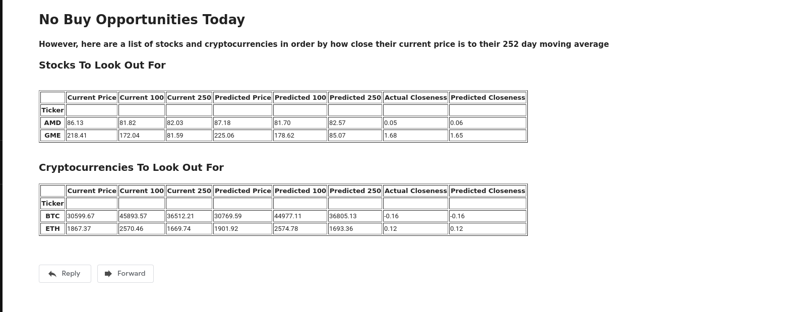

# Asset Report

# Purpose
To give the user some well deserved free time. With this program the user can stop spending every second looking for opportunities in the stock and cryptocurrency market. They can simply add the assets they are interested in to the assets.csv, run the program everyday (cron job: Linux, task scheduler: Windows) and wait for an email telling them of good buy opportunities.
# What Does it Do
- Takes in a list of stocks and cryptocurrencies.
- Runs them all through an ARIMA model.
- Performs a basic analysis on them.
    - Checks to see how close the current/predicted price is to it's current/predicted 252 day moving average.
        - If it is within x% or below it's 252 day moving average, it is considered a good buy opportunity.
        - If it is not, then it is put into a dataframe where it is indexed by how close the actual price is to it's 252 day moving average.
- Emails a list of assets if the analysis says they are a good buy.
    - You could recieve up to 4 dataframes in the email.
        - Stock: Buy
        - Crypto: Buy
        - Stock: Wait
        - Crypto: Wait
    - The minimum number of dataframes you will receive is 2.
        - Stock: Wait
        - Crypto: Wait

# Weakness
This program is not meant to be run every hour or ever second. Rather it is mean to be ran once every day. It is not meant for traders with intraday strategies, but rather for investors with a long term strategy. However, the code as of today wouldn't need much alteration to be able to run intraday strategies.

# Example Email

# Required Setup
## Get a free API key from Coin API
- [Link Here](https://www.coinapi.io/)

## Make sure you get a password for less secure applications from Google.
- This is required by Google to send yourself emails using an application like this.
- Accounts -> Security -> App Passwords

## Create a file called ".env" and put it in /Data/
- You could just rename the file that is already there and enter in your information.
- Crypto api
- Email Address
- Google's Less Secure Password

## Populate the assets.csv
- Add the tickers of the stocks and cryptocurrencies you want to track in their respective columns.

## Install the required packages
- `pip install -r /path/to/requirements.txt`

## Set the program to run on a scheduled basis - Recommended
- Windows: Task Scheduler
    - [How To](https://www.windowscentral.com/how-create-automated-task-using-task-scheduler-windows-10)
- Linux: Cron Job
    - [Overview](https://phoenixnap.com/kb/set-up-cron-job-linux)
    - [Cron Creator](https://crontab.guru/)
